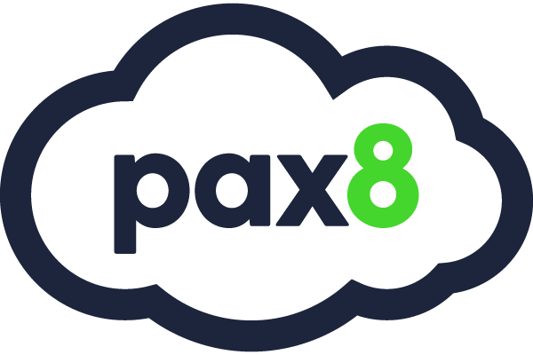

<div id="top"></div>

<!-- PROJECT LOGO -->
<br />
<div align="center">
  <a href="https://github.com/dkschruteBeets/Pax8-API">
    
  </a>

<h2 align="center">Pax8 REST API</h2>

  <p align="center">
    A PowerShell Module for the <a href="https://docs.pax8.com/api/v1"><strong>Pax8 REST API</strong></a>
    <br />
    <a href="https://github.com/dkschruteBeets/Pax8-API/blob/master/Pax8-API.md"><strong>Explore the docs »</strong></a>
    <br />
  </p>
</div>

<!-- PROJECT SHIELDS -->
<div align="center">

[![Forks][forks-shield]][forks-url] [![Issues][issues-shield]][issues-url] [![MIT License][license-shield]][license-url] [![PS Gallery][ps-shield]][ps-url]

</div>


<!-- REPORT & REQUEST -->
<p align="center">
<a href="https://github.com/dkschruteBeets/Pax8-API/issues">Report Bug</a>
    ·
    <a href="https://github.com/dkschruteBeets/Pax8-API/issues">Request Feature</a>
</p>

<!-- ABOUT THE PROJECT -->
## About The Project

This project exists to streamline Pax8 interactions and provide a way to automate tasks within the platform.


<!-- GETTING STARTED -->
## Getting Started

The Pax8 REST API requires a `Developer Application` to authenticate and make requests. This provides a `client_id` and `client_secret` which is used in this module to connect to the API.

_For more information, please refer to the [Pax8 Documentation](https://docs.pax8.com/api/v1#section/Create-a-Developer-Application)_

### Installation

```powershell
Install-Module -Name 'Pax8-API'
```


<!-- USAGE EXAMPLES -->
## Usage

Run the initial connect command:

```powershell
Connect-Pax8 -credential <client_id>
```

_For a complete list of commands, please refer to the [Documentation](https://github.com/dkschruteBeets/Pax8-API/blob/master/Pax8-API.md)_


<!-- CONTRIBUTING -->
## Contributing

If you have a suggestion that would make this better, please fork the repo and create a pull request.

1. Fork the Project
2. Create your Feature Branch (`git checkout -b feature/CoolFeature`)
3. Commit your Changes (`git commit -m 'Add some CoolFeature'`)
4. Push to the Branch (`git push origin feature/CoolFeature`)
5. Open a Pull Request

<!-- LICENSE -->
## License

Distributed under the MIT License. See `LICENSE.txt` for more information.

<!-- ACKNOWLEDGMENTS -->
## Acknowledgments

* [Animals as Leaders](https://www.youtube.com/watch?v=N0RbJRY_pU8) - Many hours were spent listening to these guys while working on this project. 🎶
* [christaylorcodes](https://github.com/christaylorcodes) - I drew a ton of inspiration from his ConnectWise module. Good stuff. 🤘
* ... and of course, [Dwight Kurt Schrute III](https://theoffice.fandom.com/wiki/Dwight_Schrute) 🐻


<!-- MARKDOWN LINKS & IMAGES -->
<!-- https://www.markdownguide.org/basic-syntax/#reference-style-links -->
[forks-shield]: https://img.shields.io/github/forks/dkschruteBeets/Pax8-API?color=%2344d62c&logo=GitHub
[forks-url]: https://github.com/dkschruteBeets/Pax8-API/network/members
[issues-shield]: https://img.shields.io/github/issues/dkschruteBeets/Pax8-API?color=%2344d62c&logo=GitHub
[issues-url]: https://github.com/dkschruteBeets/Pax8-API/issues
[license-shield]: https://img.shields.io/github/license/dkschruteBeets/Pax8-API?color=%2344d62c&label=license&logo=GitHub
[license-url]: https://github.com/dkschruteBeets/Pax8-API/blob/master/LICENSE.txt
[ps-shield]: https://img.shields.io/powershellgallery/v/Pax8-API?color=%2344d62c&label=PS%20Gallery&logo=powershell&logoColor=white
[ps-url]: https://www.powershellgallery.com/packages/Pax8-API
